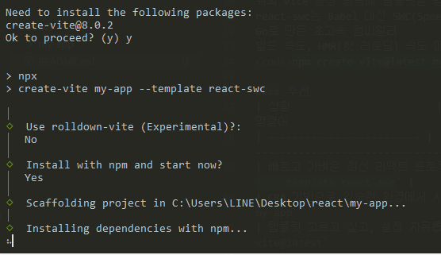

### Node.js 버전 확인  
- node -v  

### npm 버전 확인
- npm -v  

### 순수 리엑트 설치  
| 명령어                                                         | 설명                           | 특징                          |
| ----------------------------------------------------------- | ---------------------------- | --------------------------- |
| `npx create-react-app my-app`                           | **Create React App**(CRA) 사용 | 전통적인 방식, 설정 자동화, Webpack 기반 |
| `npm create vite@latest my-app`                         | Vite로 프로젝트 생성                | 빠름, 설정 유연, 최신 개발 방식         |
| `npm create vite@latest my-app -- --template react-swc` | Vite + React + SWC 사용        | Vite 기반 + SWC 컴파일러로 더 빠른 빌드 |

#### 상세 설명
1. npx create-react-app my-app  
CRA(Create React App) 도구를 사용해서 리액트 앱을 생성  
내부적으로 Webpack, Babel 등을 자동 설정  
장점: 초보자에게 친숙하고 안정적  
단점: 설정 수정이 어려움 (eject 없이 내부 설정 보기 힘듦), 무겁고 느림 
<code>npx create-react-app my-app</code> 

2. npm create vite@latest my-app  
Vite는 CRA보다 훨씬 빠른 프론트엔드 빌드 툴  
npm create는 create-* 스크립트를 실행하는 방법  
기본 템플릿 선택 가능 (vanilla, react, vue, svelte 등)  
CRA보다 더 빠른 개발 서버 시작 속도와 빌드 시간 제공  
<code>npm create vite@latest my-app</code>

3. **_npm create vite@latest my-app -- --template react-swc_** ✅   
위의 Vite 생성 명령에 템플릿을 명확히 지정  
react-swc는 Babel 대신 SWC(Speedy Web Compiler) 사용  
Go로 만든 초고속 컴파일러  
빌드 속도, HMR(핫 리로딩) 속도 매우 빠름  
<code>npm create vite@latest my-app -- --template react-swc</code>

#### 추천
| 상황                        | 추천 명령어                                                  |
| ------------------------- | ------------------------------------------------------- |
| 빠르고 가벼운 최신 리액트 프로젝트 시작    | `npm create vite@latest my-app -- --template react-swc` |
| CRA 기반으로 익숙한 환경에서 시작하고 싶음 | `npx create-react-app my-app`                           |
| 템플릿 고르고 싶고, 설정 자유롭게 하고 싶음 | `npm create vite@latest`                                |

---



---

#### 서버 실행
- <code>npm run dev</code>

#### 확장 프로그램 설치
- ES7+ React/Redux/React-Native snippets

#### .jsx 파일 기본 템플릿 셋팅
- <code>rafce</code>

---

#### 리엑트안에서 절대경로
```
React 자체라기보다는, React 프로젝트에서 사용하는 빌드 도구 — 
예를 들어:
Vite
Create React App (CRA)
Next.js (조금 다르지만 비슷한 개념 있음)
이런 도구들이 / 경로를 public/ 폴더로 고정해서 처리하도록 만들어져 있어요.

/는 실제로는 public 폴더 루트를 가리킴

왜 이렇게 동작하게 만들었을까?
이렇게 하면:
정적 자원(favicon, 로고, 외부 JS/CSS 파일 등)을 쉽게 다룰 수 있고
빌드 시 해당 자원들은 번들에 포함되지 않고 그대로 복사됨
상대 경로 문제 없이 /images/xx.jpg처럼 절대 경로로 바로 접근 가능함

⚠️ 주의할 점
public 폴더는 import로 접근할 수 없음. → src 파일에서는 그냥 URL처럼 /이미지.jpg로 써야 함
반대로 src 폴더 안의 파일은 반드시 import 해서 사용해야 함 → /로 접근 불가능
```

#### 🍕
my-app4: props  
my-app4: useState(hooks)  
         - Com4.jsx: login, logout  
